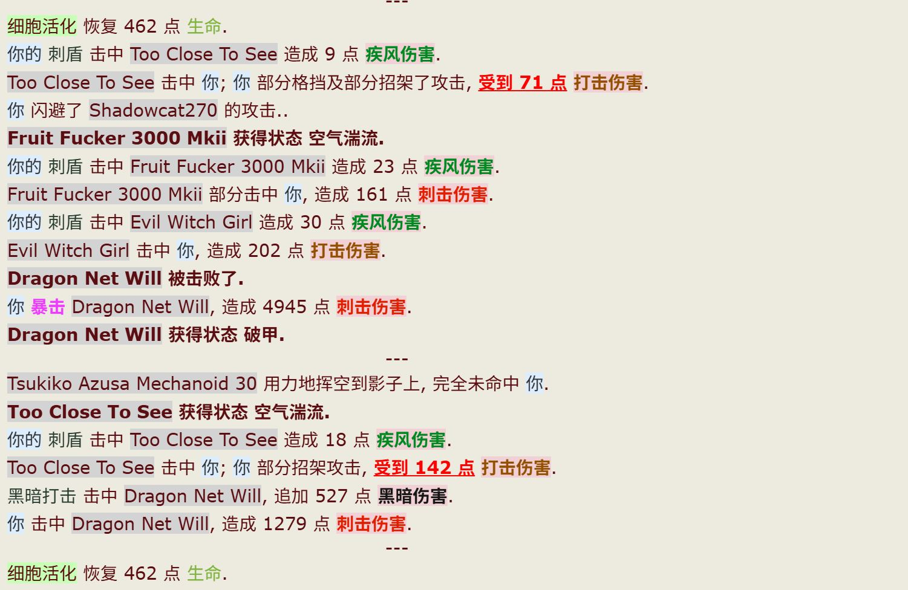

# HVSinicization
汉化HV的战斗日志

作为一位英文渣渣在多方寻找后，由TG大佬@qp_xe提供了原始的汉化脚本
 我在此基础上复制了[战斗日志汉化脚本](https://sleazyfork.org/zh-CN/scripts/404119-hv-%E7%89%A9%E5%93%81%E8%A3%85%E5%A4%87%E6%B1%89%E5%8C%96/code)中关于装备的汉化文本
 对照表来自[EXwiki](https://ehwiki.org/wiki/Main_Page)

- 问:为什么颜色这么辣眼睛
  - 答:纯新手,能起到"醒目"和"易于辨识"就算达到我的要求了
  - 经过 mbbdzz 修改后观感应该更好了,甚至还能给新人提示后缀代表的含义
- 问:为什么这些文本看起来这么奇怪
  - 答:照葫芦画瓢的代码,能翻译就行
## 使用方法
 - 复制 `HVSinicization.js` 的源码直接粘贴至油猴内

## 鸣谢
原作者: [𝓺𝓹𝔁𝓮💤](https://t.me/qp_xe) 授权初始代码
 大佬: [indefined](https://github.com/indefined) 对脚本问题的修正
 贴吧用户 mbbdzz 对汉化文本以及部分文本颜色的修饰 ~~终于不那么辣眼睛了~~
 在此我由衷的感谢你们为HVSinicization做出的贡献,以后还请多多指教

## 👆以上原始信息仅供参考
基于上游 [WayneFerdon/HVSinicization](https://github.com/WayneFerdon/HVSinicization)

和上上游 [1235789gzy1/HVSinicization](https://github.com/1235789gzy1/HVSinicization)

**爆改** (~~除了名字和翻译, 其他基本都不一样~~

新实现功能:
- 可切换中英显示, 需要 [HVTranslate](https://github.com/indefined/UserScripts/tree/master/HVTranslate) 

  安装后在战斗界面点击 `战斗翻译开关` 同步切换
  
  翻译记录长度与英文保持一致, 方便对照. 
- 重新调整了颜色, 还能自定义添加/修改颜色组批量更新
- 更新了翻译, 基本的应该覆盖了, (~~也许有删多的地方等发现再补上~~
- 易于区分的行动周期
- 物品的显示颜色只搞了部分. (~~感觉不太重要暂时先不管了~~

### 预览图

